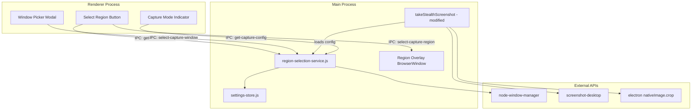
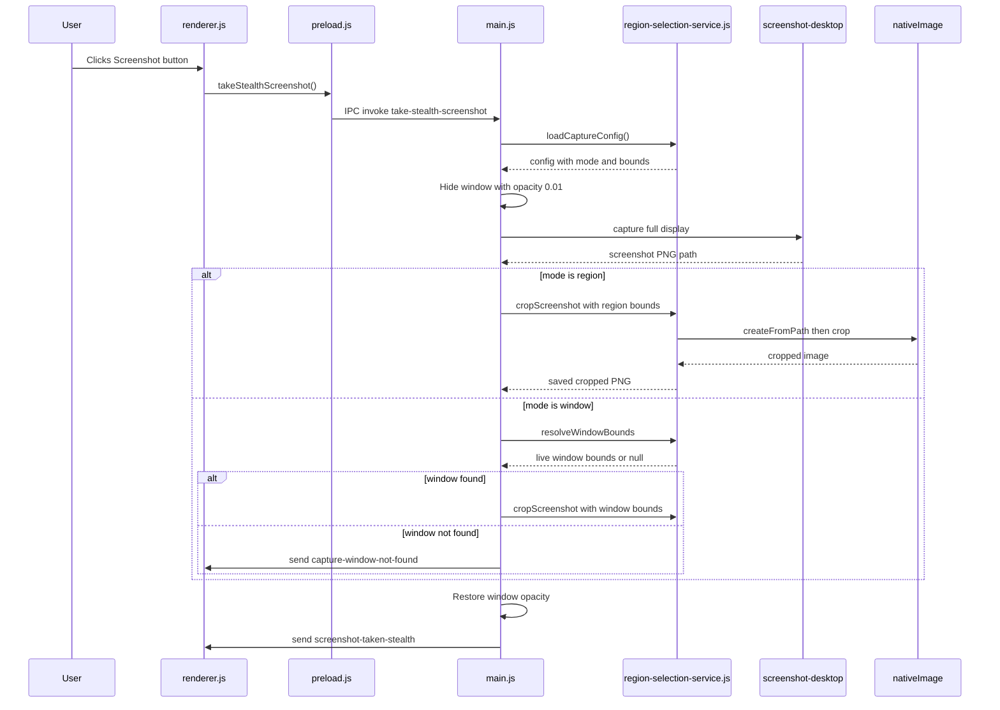

# Phase 5: Screen Region Selection -- Implementation Plan

## Codebase Context

Key existing code to build on:

- **Screenshot pipeline:** `[src/main.js](src/main.js)` lines 468-578 -- `takeStealthScreenshot()` captures via `screenshot-desktop`, manages display mapping, stores PNG to disk, tracks max 3 screenshots in a `screenshots[]` array
- **Settings persistence:** `[src/settings-store.js](src/settings-store.js)` -- `electron-store` with schema validation; screenshot settings at lines 97-105 currently store `maxCount` and `captureDelay`
- **UI buttons:** `[src/renderer.html](src/renderer.html)` lines 55-110 -- `.action-buttons` container with 9 buttons (voice, screenshot, analyze, suggest, notes, insights, clear, hide, settings)
- **Preload bridge:** `[src/preload.js](src/preload.js)` -- exposes `window.electronAPI` via `contextBridge`
- **Installed but unused:** `node-window-manager` v2.2.4 is in `[package.json](package.json)` line 18 and already configured for `asarUnpack` (line 45)
- **No new dependencies needed:** `screenshot-desktop` (capture) + `node-window-manager` (window enum) + `electron.nativeImage` (crop) cover everything

---

## Architecture




---

## File Changes

### New Files (4)

- `**src/region-selection-service.js**` -- Core service: window enumeration via `node-window-manager`, capture config CRUD, window re-detection, crop helper using `electron.nativeImage`
- `**src/region-overlay.html**` -- Fullscreen transparent overlay for click-and-drag rectangle drawing with confirm/cancel buttons
- `**src/region-overlay.js**` -- Renderer logic for the overlay: mouse events, rectangle drawing, coordinate display, marching-ants animation
- `**src/region-overlay-preload.js**` -- Minimal preload exposing `confirmRegion(bounds)` and `cancelRegion()` IPC calls

### Modified Files (5)

- `**[src/main.js](src/main.js)**` -- Import region service, register new IPC handlers, modify `takeStealthScreenshot()` to branch on capture mode, register `Ctrl+Alt+Shift+R` shortcut, spawn/destroy overlay window
- `**[src/renderer.html](src/renderer.html)**` -- Add "Select Region" button (between screenshot and analyze buttons), add capture mode indicator badge, add window picker modal markup
- `**[src/renderer.js](src/renderer.js)**` -- Region button click handler (context menu: Draw Region / Pick Window / Full Screen), window picker modal logic with search/filter, mode indicator updates
- `**[src/preload.js](src/preload.js)**` -- Expose 5 new IPC methods: `selectCaptureRegion`, `getOpenWindows`, `selectCaptureWindow`, `resetCaptureMode`, `getCaptureConfig`, plus `onCaptureConfigChanged` listener
- `**[src/settings-store.js](src/settings-store.js)**` -- Extend schema with `capture` section (mode, region bounds, window title/processName, followWindow, monitorIndex)

---

## Task-by-Task Implementation Details

### Step 1: Settings Schema (Task 5.3 - Foundation)

Extend the schema in `[src/settings-store.js](src/settings-store.js)` inside the existing `schema` object (after the `screenshot` block at line 105):

```javascript
capture: {
  type: 'object',
  default: {},
  properties: {
    mode: { type: 'string', enum: ['fullScreen', 'region', 'window'], default: 'fullScreen' },
    region: {
      type: 'object',
      default: {},
      properties: {
        x: { type: 'number', default: 0 },
        y: { type: 'number', default: 0 },
        width: { type: 'number', default: 0 },
        height: { type: 'number', default: 0 }
      }
    },
    window: {
      type: 'object',
      default: {},
      properties: {
        title: { type: 'string', default: '' },
        processName: { type: 'string', default: '' },
        followWindow: { type: 'boolean', default: true }
      }
    },
    monitorIndex: { type: 'number', default: 0 }
  }
}
```

Add getter/setter methods to the `SettingsStore` class:

- `getCaptureConfig()` -- returns the capture object
- `setCaptureConfig(config)` -- validates and stores
- `resetCaptureMode()` -- sets mode to `fullScreen`, clears region/window

---

### Step 2: Region Selection Service (Tasks 5.2, 5.3, 5.4 - Core)

Create `src/region-selection-service.js` as a CommonJS module:

**Window enumeration (Task 5.2):**

- Import `const { windowManager } = require('node-window-manager');`
- `getOpenWindows()` -- calls `windowManager.getWindows()`, filters out invisible/system windows and the EchoAssist window itself, returns array of `{ id, title, processName, bounds }`
- `getMeetingWindows()` -- filters by known process names: `Teams`, `Zoom`, `zoom.us`, `Google Meet`, `Webex`, `Slack`
- Handle the case where `node-window-manager` throws (e.g., missing permissions on macOS) -- return empty array with error info

**Region persistence (Task 5.3):**

- `saveCaptureConfig(config)` -- validates bounds are positive integers, writes to settings store
- `loadCaptureConfig()` -- reads from settings store, returns with defaults if missing
- `resetToFullScreen()` -- clears config, sets mode to `fullScreen`

**Window re-detection (Task 5.3):**

- `resolveWindowBounds(savedConfig)` -- called before each capture in window mode
  - Re-enumerate windows, find match by `processName` first, then `title` substring
  - If found: return current bounds
  - If not found: return `null` (caller falls back to full screen)

**Crop helper (Task 5.4):**

- `cropScreenshot(screenshotPath, region, scaleFactor)` -- uses `const { nativeImage } = require('electron');`
  - `nativeImage.createFromPath(screenshotPath)` to load
  - `.crop({ x: region.x * scaleFactor, y: region.y * scaleFactor, width: region.width * scaleFactor, height: region.height * scaleFactor })`
  - Write cropped PNG back to same path via `.toPNG()`
  - Return the path

---

### Step 3: Region Overlay Window (Task 5.1 - UI)

`**src/region-overlay.html**` -- Minimal HTML:

- Full-viewport `<canvas>` element for drawing
- Floating info panel showing coordinates and dimensions
- "Confirm" and "Cancel" buttons (appear after selection)
- Inline CSS for dark semi-transparent background, crosshair cursor

`**src/region-overlay.js**` -- Canvas-based selection:

- `mousedown` -> record start point, begin drawing
- `mousemove` -> clear canvas, redraw dark overlay with transparent cutout for selected rectangle, show dashed border with animated offset (marching ants), update coordinate display
- `mouseup` -> finalize rectangle, show confirm/cancel buttons
- Corner resize handles for fine-tuning after initial draw
- ESC key to cancel

`**src/region-overlay-preload.js**` -- Two IPC methods:

- `confirmRegion(bounds)` -> `ipcRenderer.invoke('confirm-capture-region', bounds)`
- `cancelRegion()` -> `ipcRenderer.invoke('cancel-capture-region')`

**Overlay BrowserWindow creation** (in `main.js`):

- Spawned on demand when user triggers "Draw Region"
- Properties: `fullscreen: true`, `transparent: true`, `frame: false`, `alwaysOnTop: true` (above main window), `skipTaskbar: true`
- `setContentProtection(false)` -- overlay must be visible to the user
- Spawns on the **same display** as the main window (use `screen.getDisplayMatching()`)
- Destroyed after confirm or cancel

---

### Step 4: UI Controls and Mode Indicator (Task 5.5)

**New button in `[src/renderer.html](src/renderer.html)`:**

- Insert a "Select Region" button after the screenshot button (line 66), before the analyze button (line 68)
- Use a crop/region SVG icon
- Add `title="Select Capture Region (Ctrl+Alt+Shift+R)"`

**Capture mode indicator:**

- Small badge element appended to the screenshot button area
- Text content changes based on mode:
  - `fullScreen` -> no badge (default behavior)
  - `region` -> badge shows region dimensions, e.g., "800x600"
  - `window` -> badge shows truncated window name, e.g., "Teams"

**Window picker modal in `[src/renderer.html](src/renderer.html)`:**

- Reuse the existing settings modal pattern (settings modal already exists)
- Search/filter input at top
- Scrollable list of windows with title and process name
- Meeting app entries highlighted with a colored dot
- "Full Screen" option at the top of the list
- Close on selection or ESC

**Click behavior in `[src/renderer.js](src/renderer.js)`:**

- Region button click opens a small context menu (3 options):
  1. "Draw Region" -> calls `window.electronAPI.selectCaptureRegion()`
  2. "Pick Window" -> opens the window picker modal
  3. "Full Screen" -> calls `window.electronAPI.resetCaptureMode()`
- Window picker: on selection, calls `window.electronAPI.selectCaptureWindow({ title, processName })`
- Listen for `capture-config-changed` event to update the mode badge

---

### Step 5: Keyboard Shortcut (Task 5.5)

In `[src/main.js](src/main.js)`, register alongside existing shortcuts (around line 365):

- `CommandOrControl+Alt+Shift+R` -> opens the region selection overlay directly (same as "Draw Region")

---

### Step 6: Modify Screenshot Pipeline (Task 5.4)

Modify `takeStealthScreenshot()` in `[src/main.js](src/main.js)` (lines 468-578):

```javascript
async function takeStealthScreenshot() {
  const captureConfig = regionService.loadCaptureConfig();
  
  // ... existing opacity hide + display detection + capture logic ...
  // (capture full screen as before)
  
  // NEW: Post-capture cropping based on mode
  if (captureConfig.mode === 'region') {
    const scaleFactor = currentDisplay.scaleFactor ?? 1;
    await regionService.cropScreenshot(screenshotPath, captureConfig.region, scaleFactor);
  } else if (captureConfig.mode === 'window') {
    const windowBounds = regionService.resolveWindowBounds(captureConfig);
    if (windowBounds !== null) {
      const scaleFactor = currentDisplay.scaleFactor ?? 1;
      // Adjust bounds relative to display origin
      const relBounds = {
        x: windowBounds.x - currentDisplay.bounds.x,
        y: windowBounds.y - currentDisplay.bounds.y,
        width: windowBounds.width,
        height: windowBounds.height
      };
      await regionService.cropScreenshot(screenshotPath, relBounds, scaleFactor);
    } else {
      // Window not found -- notify renderer, capture full screen as fallback
      mainWindow.webContents.send('capture-window-not-found', captureConfig.window.title);
    }
  }
  
  // ... existing screenshot array management + opacity restore ...
}
```

Key detail: The crop coordinates must be **relative to the captured display's origin**, not absolute screen coordinates. When a window is on display 2 (origin 1920,0), subtract the display origin before cropping.

---

### Step 7: IPC Handlers (Tasks 5.1-5.5)

Add to `[src/main.js](src/main.js)` alongside existing IPC handlers (around line 770+):

- `ipcMain.handle('select-capture-region')` -- creates and shows the overlay window
- `ipcMain.handle('confirm-capture-region', (_, bounds)` -- saves config, destroys overlay, notifies renderer
- `ipcMain.handle('cancel-capture-region')` -- destroys overlay without saving
- `ipcMain.handle('get-open-windows')` -- calls `regionService.getOpenWindows()`
- `ipcMain.handle('select-capture-window', (_, windowInfo))` -- saves window config
- `ipcMain.handle('reset-capture-mode')` -- calls `regionService.resetToFullScreen()`
- `ipcMain.handle('get-capture-config')` -- returns current config

Add to `[src/preload.js](src/preload.js)` inside the `electronAPI` object:

```javascript
selectCaptureRegion: () => ipcRenderer.invoke('select-capture-region'),
getOpenWindows: () => ipcRenderer.invoke('get-open-windows'),
selectCaptureWindow: (windowInfo) => ipcRenderer.invoke('select-capture-window', windowInfo),
resetCaptureMode: () => ipcRenderer.invoke('reset-capture-mode'),
getCaptureConfig: () => ipcRenderer.invoke('get-capture-config'),
onCaptureConfigChanged: (callback) => ipcRenderer.on('capture-config-changed', (_, config) => callback(config)),
onCaptureWindowNotFound: (callback) => ipcRenderer.on('capture-window-not-found', (_, title) => callback(title)),
```

---

### Step 8: Visual Feedback (Task 5.6)

- **Capture flash:** After cropping completes, briefly pulse the main window border (CSS animation triggered via `mainWindow.webContents.send('screenshot-flash')`)
- **Mode-specific colors:** Blue flash for region, green flash for window, white for full screen
- **Window not found toast:** When target window is gone, show an inline notification in the chat area: "Target window '[title]' not found -- captured full screen instead"
- **Thumbnail badge:** When displaying screenshot thumbnails in chat, overlay a small "Region" or "Window" badge on the corner

---

### Step 9: Styles (Task 5.6)

Add to `[src/styles.css](src/styles.css)`:

- `.region-btn` -- same styling as other action buttons, crop icon
- `.capture-mode-badge` -- small pill next to screenshot button; colors: gray (full), blue (region), green (window)
- `.window-picker-modal` -- reuse existing modal patterns from settings modal
- `.window-picker-item` -- list item with hover state, meeting app highlight dot
- `.window-picker-search` -- search input styling
- `@keyframes screenshot-flash` -- brief border pulse animation
- `.capture-toast` -- inline notification styling

---

### Step 10: Platform and Edge Cases (Task 5.7)

- **macOS Accessibility permission:** `node-window-manager` needs Accessibility access. If `getWindows()` returns empty or throws, show a notification guiding the user to System Preferences > Privacy > Accessibility
- **DPI/Retina:** Always multiply crop coordinates by `display.scaleFactor` (already available in the screenshot function via `currentDisplay`)
- **Window spanning monitors:** If window bounds extend beyond display bounds, clamp the crop region to the captured display area
- **Window minimized:** `node-window-manager` may return zero-size bounds for minimized windows -- detect this and fall back to full screen with a notification
- **Multi-monitor region draw:** The overlay spawns on the display where the main window is. If the user needs to capture a different display, they can move the main window first (or use "Pick Window" which works across all displays)

---

## Data Flow: Screenshot with Region Crop




---

## Implementation Order

The steps above are ordered by dependency. The recommended sequence is:

1. Settings schema (foundation, no UI impact)
2. Region selection service (core logic, can be unit tested)
3. Region overlay window (visual, depends on step 2)
4. UI controls and mode indicator (renderer changes, depends on step 2)
5. Keyboard shortcut (trivial, depends on step 3)
6. Modify screenshot pipeline (core integration, depends on steps 2-3)
7. IPC handlers (wiring, depends on steps 2-6)
8. Visual feedback (polish, depends on step 6)
9. Styles (polish, parallel with step 8)
10. Platform and edge cases (hardening, after everything works)

---

## Risks and Mitigations

- `**node-window-manager` macOS permissions:** May silently return empty list. Mitigation: detect empty result, show permission guidance notification
- **DPI mismatch in cropping:** Coordinates from overlay (CSS pixels) vs screenshot (device pixels). Mitigation: always multiply by `scaleFactor` in the crop helper
- **Overlay visible in recordings:** The overlay window has content protection OFF. Mitigation: it is short-lived (only during selection) and user-initiated
- **Region overlay on wrong monitor:** Mitigation: spawn overlay on `screen.getDisplayMatching(mainWindow.getBounds())`
- **Stale window bounds:** Between enumeration and capture, window may move. Mitigation: `resolveWindowBounds()` is called fresh on every capture

---

## CHECKLIST.md Mapping

Every item from the Phase 5 checklist is covered:

- **5.1** (Region Selection UI) -> Steps 3, 9
- **5.2** (Window Detection and Picker) -> Steps 2, 4
- **5.3** (Region Persistence) -> Steps 1, 2
- **5.4** (Screenshot Service Updates) -> Step 6
- **5.5** (UI Controls and Settings) -> Steps 4, 5, 7
- **5.6** (Visual Feedback) -> Steps 8, 9
- **5.7** (Platform Considerations) -> Step 10

